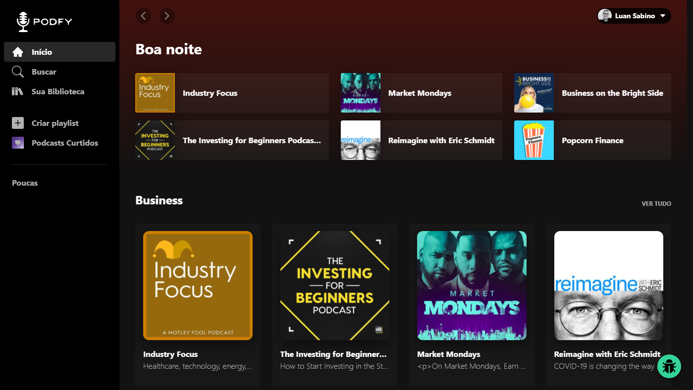

    

<h2 align="left">Sobre</h2>

Projeto realizado com o intuito de clonar a interface do Spotify fazendo uso de ReactJs e Tailwindcss.

<h2 align="center">💻</h2>

## Descrição do Projeto

A aplicação tinha como requisitos a criação de pelo menos duas paginas, sendo uma populada dinamicamente apartir de uma API, apresentando cards/tabelas/listas. E uma segunda pagina com a presença de um Form. Visando manter o layout unico do Spotify sem adicionar elementos que pudessem quebrar o fluxo de uso, decidi inserir o form dentro de uma modal, servindo como um "Bug Report" e mantendo a estrutura da pagina. 

## Pré-requisitos

Antes de começar, você vai precisar ter instalado em sua máquina as seguintes ferramentas:
[Git](https://git-scm.com), [Node.js](https://nodejs.org/en/). 
Além disto é bom ter um editor para trabalhar com o código como [VSCode](https://code.visualstudio.com/)

## Inicializando a aplicação

Primeiro você vai precisar clonar o repositorio:
  `gh repo clone luan-sabino/desafio-supersim`

Abra a pasta pelo terminal, e em seguida execute: `npm install` para instalar as dependencias do projeto.

Apos isso, execute o comando `npm start`

A partir dai basta acessar o seu localhost: `localhost:3000`

## 🛠 Tecnologias

As seguintes ferramentas foram usadas na construção do projeto:

- [Node.js](https://nodejs.org/en/)
- [React.js](https://pt-br.reactjs.org)
- [Create-react-app](https://create-react-app.dev)
- [Tailwindcss](https://tailwindcss.com)
- [React-icons](https://react-icons.github.io/)
- [ListenNotesAPI](https://www.listennotes.com/api/)

### Autor
---

<a href="https://luan-sabino.github.io">
 
  
 <b>Luan Sabino</b></a> <a href="https://luan-sabino.github.io" title="Portifolio">🚀</a>

Feito com ❤️ por Luan Sabino 👋🏽 Entre em contato!

  